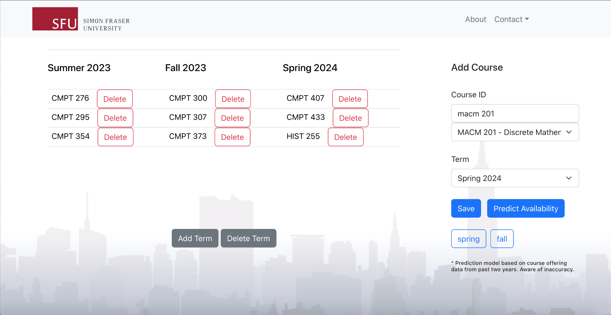
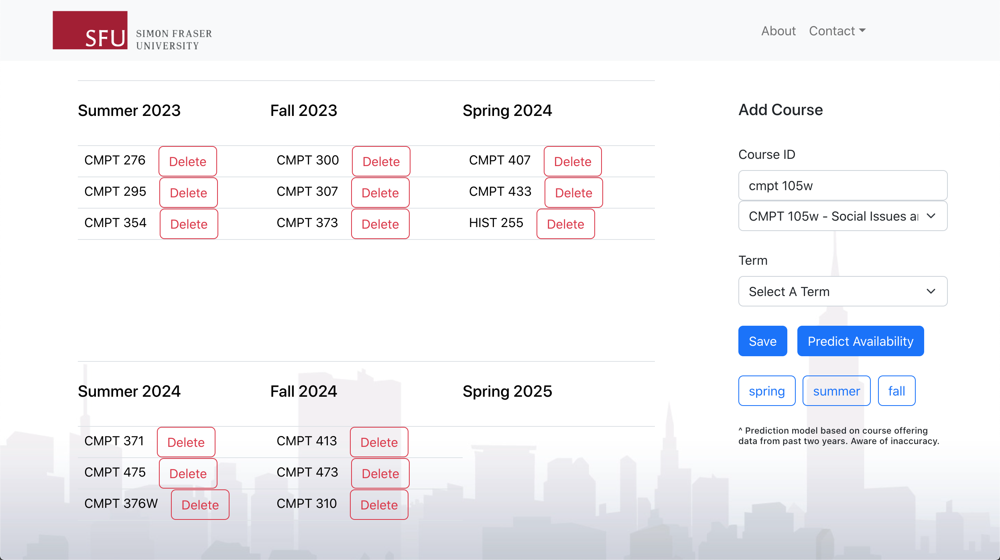

# SFU-Course-Planner

An advanced course planner web application that enables SFU students to plan ahead for their future courses. Application integrates with features such as future course offerings availbility prediction by analyzing past course offering data from SFU Course Outline REST API.





# Usage

To use this template to start your own project:

## Backend Setup
      
Inside Backend/Backend directory, build and run backend REST API through commands:

```bash
dotnet build
dotnet run
```
    
## Frontend Setup

Inside Frontend directory, install project dependencies through the following command:

```bash
npm install
```

Then run the application by typing: 

```bash
npm start
```

Your website will be hosted on port 3000 and should automatically directs you to localhost:3000 

Have fun!
